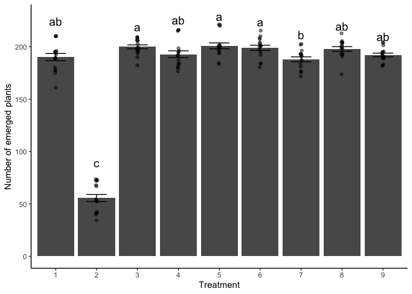

1.  Read in the data called “PlantEmergence.csv” using a relative file
    path and load the following libraries. tidyverse, lme4, emmeans,
    multcomp, and multcompView. Turn the Treatment , DaysAfterPlanting
    and Rep into factors using the function as.factor

``` r
# Load the libraries
library(tidyverse)
```

    ## ── Attaching core tidyverse packages ──────────────────────── tidyverse 2.0.0 ──
    ## ✔ dplyr     1.1.4     ✔ readr     2.1.5
    ## ✔ forcats   1.0.0     ✔ stringr   1.5.1
    ## ✔ ggplot2   3.5.1     ✔ tibble    3.2.1
    ## ✔ lubridate 1.9.3     ✔ tidyr     1.3.1
    ## ✔ purrr     1.0.2     
    ## ── Conflicts ────────────────────────────────────────── tidyverse_conflicts() ──
    ## ✖ dplyr::filter() masks stats::filter()
    ## ✖ dplyr::lag()    masks stats::lag()
    ## ℹ Use the conflicted package (<http://conflicted.r-lib.org/>) to force all conflicts to become errors

``` r
library(lme4)
```

    ## Loading required package: Matrix
    ## 
    ## Attaching package: 'Matrix'
    ## 
    ## The following objects are masked from 'package:tidyr':
    ## 
    ##     expand, pack, unpack

``` r
library(emmeans)
```

    ## Welcome to emmeans.
    ## Caution: You lose important information if you filter this package's results.
    ## See '? untidy'

``` r
library(multcomp)
```

    ## Loading required package: mvtnorm
    ## Loading required package: survival
    ## Loading required package: TH.data
    ## Loading required package: MASS
    ## 
    ## Attaching package: 'MASS'
    ## 
    ## The following object is masked from 'package:dplyr':
    ## 
    ##     select
    ## 
    ## 
    ## Attaching package: 'TH.data'
    ## 
    ## The following object is masked from 'package:MASS':
    ## 
    ##     geyser

``` r
library(multcompView)

# Read in the CSV data using a relative file path
STAND <- read_csv("PlantEmergence.csv")
```

    ## Rows: 144 Columns: 7
    ## ── Column specification ────────────────────────────────────────────────────────
    ## Delimiter: ","
    ## chr (2): DatePlanted, DateCounted
    ## dbl (5): Plot, Treatment, Rep, Emergence, DaysAfterPlanting
    ## 
    ## ℹ Use `spec()` to retrieve the full column specification for this data.
    ## ℹ Specify the column types or set `show_col_types = FALSE` to quiet this message.

``` r
# Convert relevant columns to factors
STAND$Treatment <- as.factor(STAND$Treatment)
STAND$DaysAfterPlanting <- as.factor(STAND$DaysAfterPlanting)
STAND$Rep <- as.factor(STAND$Rep)
```

2.  Fit a linear model to predict Emergence using Treatment and
    DaysAfterPlanting along with the interaction. Provide the summary of
    the linear model and ANOVA results.

``` r
# Fit the model with interaction
linear_model <- lm(Emergence ~ Treatment + DaysAfterPlanting + Treatment:DaysAfterPlanting, data = STAND)

# Summary of the linear model
summary(linear_model)
```

    ## 
    ## Call:
    ## lm(formula = Emergence ~ Treatment + DaysAfterPlanting + Treatment:DaysAfterPlanting, 
    ##     data = STAND)
    ## 
    ## Residuals:
    ##     Min      1Q  Median      3Q     Max 
    ## -21.250  -6.062  -0.875   6.750  21.875 
    ## 
    ## Coefficients:
    ##                                  Estimate Std. Error t value Pr(>|t|)    
    ## (Intercept)                     1.823e+02  5.324e+00  34.229   <2e-16 ***
    ## Treatment2                     -1.365e+02  7.530e+00 -18.128   <2e-16 ***
    ## Treatment3                      1.112e+01  7.530e+00   1.477    0.142    
    ## Treatment4                      2.500e+00  7.530e+00   0.332    0.741    
    ## Treatment5                      8.750e+00  7.530e+00   1.162    0.248    
    ## Treatment6                      7.000e+00  7.530e+00   0.930    0.355    
    ## Treatment7                     -1.250e-01  7.530e+00  -0.017    0.987    
    ## Treatment8                      9.125e+00  7.530e+00   1.212    0.228    
    ## Treatment9                      2.375e+00  7.530e+00   0.315    0.753    
    ## DaysAfterPlanting14             1.000e+01  7.530e+00   1.328    0.187    
    ## DaysAfterPlanting21             1.062e+01  7.530e+00   1.411    0.161    
    ## DaysAfterPlanting28             1.100e+01  7.530e+00   1.461    0.147    
    ## Treatment2:DaysAfterPlanting14  1.625e+00  1.065e+01   0.153    0.879    
    ## Treatment3:DaysAfterPlanting14 -2.625e+00  1.065e+01  -0.247    0.806    
    ## Treatment4:DaysAfterPlanting14 -6.250e-01  1.065e+01  -0.059    0.953    
    ## Treatment5:DaysAfterPlanting14  2.500e+00  1.065e+01   0.235    0.815    
    ## Treatment6:DaysAfterPlanting14  1.000e+00  1.065e+01   0.094    0.925    
    ## Treatment7:DaysAfterPlanting14 -2.500e+00  1.065e+01  -0.235    0.815    
    ## Treatment8:DaysAfterPlanting14 -2.500e+00  1.065e+01  -0.235    0.815    
    ## Treatment9:DaysAfterPlanting14  6.250e-01  1.065e+01   0.059    0.953    
    ## Treatment2:DaysAfterPlanting21  3.500e+00  1.065e+01   0.329    0.743    
    ## Treatment3:DaysAfterPlanting21 -1.000e+00  1.065e+01  -0.094    0.925    
    ## Treatment4:DaysAfterPlanting21  1.500e+00  1.065e+01   0.141    0.888    
    ## Treatment5:DaysAfterPlanting21  2.875e+00  1.065e+01   0.270    0.788    
    ## Treatment6:DaysAfterPlanting21  4.125e+00  1.065e+01   0.387    0.699    
    ## Treatment7:DaysAfterPlanting21 -2.125e+00  1.065e+01  -0.200    0.842    
    ## Treatment8:DaysAfterPlanting21 -1.500e+00  1.065e+01  -0.141    0.888    
    ## Treatment9:DaysAfterPlanting21 -1.250e+00  1.065e+01  -0.117    0.907    
    ## Treatment2:DaysAfterPlanting28  2.750e+00  1.065e+01   0.258    0.797    
    ## Treatment3:DaysAfterPlanting28 -1.875e+00  1.065e+01  -0.176    0.861    
    ## Treatment4:DaysAfterPlanting28  3.620e-13  1.065e+01   0.000    1.000    
    ## Treatment5:DaysAfterPlanting28  2.500e+00  1.065e+01   0.235    0.815    
    ## Treatment6:DaysAfterPlanting28  2.125e+00  1.065e+01   0.200    0.842    
    ## Treatment7:DaysAfterPlanting28 -3.625e+00  1.065e+01  -0.340    0.734    
    ## Treatment8:DaysAfterPlanting28 -1.500e+00  1.065e+01  -0.141    0.888    
    ## Treatment9:DaysAfterPlanting28 -8.750e-01  1.065e+01  -0.082    0.935    
    ## ---
    ## Signif. codes:  0 '***' 0.001 '**' 0.01 '*' 0.05 '.' 0.1 ' ' 1
    ## 
    ## Residual standard error: 10.65 on 108 degrees of freedom
    ## Multiple R-squared:  0.9585, Adjusted R-squared:  0.945 
    ## F-statistic: 71.21 on 35 and 108 DF,  p-value: < 2.2e-16

``` r
# ANOVA results
anova(linear_model)
```

    ## Analysis of Variance Table
    ## 
    ## Response: Emergence
    ##                              Df Sum Sq Mean Sq  F value    Pr(>F)    
    ## Treatment                     8 279366   34921 307.9516 < 2.2e-16 ***
    ## DaysAfterPlanting             3   3116    1039   9.1603 1.877e-05 ***
    ## Treatment:DaysAfterPlanting  24    142       6   0.0522         1    
    ## Residuals                   108  12247     113                       
    ## ---
    ## Signif. codes:  0 '***' 0.001 '**' 0.01 '*' 0.05 '.' 0.1 ' ' 1

3.  Based on the results of the linear model in question 2, do you need
    to fit the interaction term? Provide a simplified linear model
    without the interaction term but still testing both main effects.
    Provide the summary and ANOVA results. Then, interpret the intercept
    and the coefficient for Treatment 2.

``` r
# Fit the simplified model (no interaction)
linear_model_2 <- lm(Emergence ~ Treatment + DaysAfterPlanting, data = STAND)

# Summary
summary(linear_model_2)
```

    ## 
    ## Call:
    ## lm(formula = Emergence ~ Treatment + DaysAfterPlanting, data = STAND)
    ## 
    ## Residuals:
    ##      Min       1Q   Median       3Q      Max 
    ## -21.1632  -6.1536  -0.8542   6.1823  21.3958 
    ## 
    ## Coefficients:
    ##                     Estimate Std. Error t value Pr(>|t|)    
    ## (Intercept)          182.163      2.797  65.136  < 2e-16 ***
    ## Treatment2          -134.531      3.425 -39.277  < 2e-16 ***
    ## Treatment3             9.750      3.425   2.847  0.00513 ** 
    ## Treatment4             2.719      3.425   0.794  0.42876    
    ## Treatment5            10.719      3.425   3.129  0.00216 ** 
    ## Treatment6             8.812      3.425   2.573  0.01119 *  
    ## Treatment7            -2.188      3.425  -0.639  0.52416    
    ## Treatment8             7.750      3.425   2.263  0.02529 *  
    ## Treatment9             2.000      3.425   0.584  0.56028    
    ## DaysAfterPlanting14    9.722      2.283   4.258 3.89e-05 ***
    ## DaysAfterPlanting21   11.306      2.283   4.951 2.21e-06 ***
    ## DaysAfterPlanting28   10.944      2.283   4.793 4.36e-06 ***
    ## ---
    ## Signif. codes:  0 '***' 0.001 '**' 0.01 '*' 0.05 '.' 0.1 ' ' 1
    ## 
    ## Residual standard error: 9.688 on 132 degrees of freedom
    ## Multiple R-squared:  0.958,  Adjusted R-squared:  0.9545 
    ## F-statistic: 273.6 on 11 and 132 DF,  p-value: < 2.2e-16

``` r
# ANOVA
anova(linear_model_2)
```

    ## Analysis of Variance Table
    ## 
    ## Response: Emergence
    ##                    Df Sum Sq Mean Sq F value    Pr(>F)    
    ## Treatment           8 279366   34921 372.070 < 2.2e-16 ***
    ## DaysAfterPlanting   3   3116    1039  11.068 1.575e-06 ***
    ## Residuals         132  12389      94                      
    ## ---
    ## Signif. codes:  0 '***' 0.001 '**' 0.01 '*' 0.05 '.' 0.1 ' ' 1

Interpretation of the intercept and the coefficient for treatment 2:

- Intercept: The intercept in this model represents the predicted mean
  Emergence for the reference levels of each factor (i.e., the first
  level of Treatment and the first level of DaysAfterPlanting).
- Coefficient for Treatment2: This coefficient tells us the difference
  in Emergence between Treatment 2 and the reference Treatment
  (Treatment 1), holding DaysAfterPlanting at its reference level.

For example, if Treatment1 is the reference, a positive slope for
Treatment2 means that plants under Treatment 2 have, on average, higher
Emergence than those under Treatment 1 (assuming the difference is
statistically significant). A negative slope would mean the opposite.

4.  Calculate the least square means for Treatment using the emmeans
    package and perform a Tukey separation with the compact letter
    display using the cld function. Interpret the results.

``` r
# Calculate lsmeans for Treatment based on the simplified model linear_model_2
(lsm_treatment <- emmeans(linear_model_2, ~ Treatment))
```

    ##  Treatment emmean   SE  df lower.CL upper.CL
    ##  1          190.2 2.42 132    185.4    194.9
    ##  2           55.6 2.42 132     50.8     60.4
    ##  3          199.9 2.42 132    195.1    204.7
    ##  4          192.9 2.42 132    188.1    197.7
    ##  5          200.9 2.42 132    196.1    205.7
    ##  6          199.0 2.42 132    194.2    203.8
    ##  7          188.0 2.42 132    183.2    192.8
    ##  8          197.9 2.42 132    193.1    202.7
    ##  9          192.2 2.42 132    187.4    196.9
    ## 
    ## Results are averaged over the levels of: DaysAfterPlanting 
    ## Confidence level used: 0.95

``` r
# Perform Tukey pairwise comparisons and get compact letter display
(treatment_cld <- cld(lsm_treatment, alpha = 0.05, Letters = letters))
```

    ##  Treatment emmean   SE  df lower.CL upper.CL .group
    ##  2           55.6 2.42 132     50.8     60.4  a    
    ##  7          188.0 2.42 132    183.2    192.8   b   
    ##  1          190.2 2.42 132    185.4    194.9   bc  
    ##  9          192.2 2.42 132    187.4    196.9   bc  
    ##  4          192.9 2.42 132    188.1    197.7   bc  
    ##  8          197.9 2.42 132    193.1    202.7   bc  
    ##  6          199.0 2.42 132    194.2    203.8    c  
    ##  3          199.9 2.42 132    195.1    204.7    c  
    ##  5          200.9 2.42 132    196.1    205.7    c  
    ## 
    ## Results are averaged over the levels of: DaysAfterPlanting 
    ## Confidence level used: 0.95 
    ## P value adjustment: tukey method for comparing a family of 9 estimates 
    ## significance level used: alpha = 0.05 
    ## NOTE: If two or more means share the same grouping symbol,
    ##       then we cannot show them to be different.
    ##       But we also did not show them to be the same.

Interpretation: Treatment 2 stands out with the lowest mean emergence
(55.6) and does not share any letters with the other treatments,
indicating it is significantly lower than all others. Treatment 7 has a
higher mean emergence (188.0) than Treatment 2, but because it has the
letter “b” and Treatments 1, 9, 4, and 8 have “bc,” Treatment 7 is not
significantly different from that “bc” group. Treatments 1, 9, 4, and 8
overlaps with both Treatment 7 (“b”) and Treatments 6, 3, and 5 (“c”).
Treatments 6, 3, and 5 show the highest means, forming the top group and
sharing no letters with Treatment 2 or 7, meaning they are significantly
higher than those two. Consequently, there are three layers of mean
emergence: the lowest group (Treatment 2), a middle cluster (Treatments
7, 1, 9, 4, and 8), and the highest group (Treatments 6, 3, and 5).

5.  The provided function lets you dynamically add a linear model plus
    one factor from that model and plots a bar chart with letters
    denoting treatment differences. Use this model to generate the plot
    shown below. Explain the significance of the letters.

``` r
# Define the function to create a bar chart with letters showing significant differences
plot_cldbars_onefactor <- function(lm_model, factor) {
  data <- lm_model$model
  variables <- colnames(lm_model$model)
  dependent_var <- variables[1]
  independent_vars <- variables[2:length(variables)]
  
  lsmeans <- emmeans(lm_model, as.formula(paste("~", factor))) # estimate lsmeans
  Results_lsmeans <- cld(lsmeans, alpha = 0.05, reversed = TRUE, details = TRUE, Letters = letters)
  
  # Extract the letters for the bars
  sig.diff.letters <- data.frame(Results_lsmeans$emmeans[,1], 
                                 str_trim(Results_lsmeans$emmeans[,7]))
  colnames(sig.diff.letters) <- c(factor, "Letters")
  
  # Summarize means for plotting and merge with letters
  ave_stand2 <- lm_model$model %>%
    group_by(!!sym(factor)) %>%
    summarize(
      ave.emerge = mean(.data[[dependent_var]], na.rm = TRUE),
      se = sd(.data[[dependent_var]]) / sqrt(n())
    ) %>%
    left_join(sig.diff.letters, by = factor) %>%
    mutate(letter_position = ave.emerge + 10 * se)
  
  # Create the plot
  plot <- ggplot(data, aes(x = !! sym(factor), y = !! sym(dependent_var))) + 
    stat_summary(fun = mean, geom = "bar") +
    stat_summary(fun.data = mean_se, geom = "errorbar", width = 0.5) +
    ylab("Number of emerged plants") + 
    geom_jitter(width = 0.02, alpha = 0.5) +
    geom_text(data = ave_stand2, aes(label = Letters, y = letter_position), size = 5) +
    xlab(as.character(factor)) +
    theme_classic()
  
  return(plot)
}

# Now call this function with our simplified model (linear_model_2) and the factor we are interested in, "Treatment"
my_plot <- plot_cldbars_onefactor(linear_model_2, "Treatment")
my_plot
```

<!-- -->

Interpretation: The letters above each bar indicate which treatments
differ significantly. Treatments that share at least one letter are not
significantly different, while those with no letters in common are
significantly different.

6.  Generate the gfm .md file along with a .html, .docx, or .pdf.
    Commit, and push the .md file to github and turn in the .html,
    .docx, or .pdf to Canvas. Provide me a link here to your github.

Link\[<https://github.com/RaimundoEspejo/Coding_Challenge_7.git>\]
